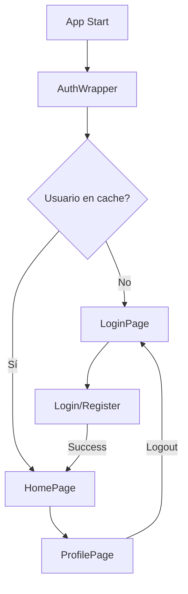

# Fake Store E-commerce

Aplicación Flutter de e-commerce completa que consume la [Fake Store API](https://fakestoreapi.com/). Desarrollada siguiendo Clean Architecture y el patrón BLoC para manejo de estado.

[](https://flutter.dev)
[](https://dart.dev)
[](test/)
[](https://dart.dev/tools/linter-rules)

## ✨ Características

### 🛍️ E-commerce Completo
- **Catálogo de productos** - Navegación por categorías y listado completo
- **Búsqueda** - Búsqueda de productos con debounce de 300ms
- **Detalle de producto** - Vista detallada con rating y descripción
- **Carrito de compras** - Agregar, eliminar y modificar cantidades con persistencia
- **Checkout** - Flujo de compra completo con confirmación
- **Historial de órdenes** - Visualización de compras realizadas

### 🔐 Autenticación (Nuevo)
- **Login** - Inicio de sesión con validación de credenciales
- **Registro** - Crear nueva cuenta con validaciones
- **Logout** - Cierre de sesión seguro
- **Persistencia de sesión** - Mantiene al usuario logueado
- **Auth Wrapper** - Redirección automática según estado de autenticación

### 👤 Perfil de Usuario (Nuevo)
- **Información del usuario** - Nombre, email, username
- **Navegación rápida** - Acceso a pedidos y soporte
- **Cerrar sesión** - Con diálogo de confirmación
- **Estado no autenticado** - Botones de login/registro

### 💬 Soporte y Ayuda (Nuevo)
- **FAQs** - 18 preguntas frecuentes categorizadas
- **Categorías** - Orders, Payments, Shipping, Returns, Account, General
- **Formulario de contacto** - Envío de mensajes con validación
- **Información de contacto** - Email y teléfono de soporte

### 🎨 Integración con Design System
- **Todos los componentes** - Atoms, Molecules, Organisms
- **Tokens personalizables** - Colores, espaciado, tamaños
- **Patrón Atomic Design** - Componentes reutilizables y escalables

### 🔧 Características Técnicas
- **Parametrización JSON** - Textos e imágenes configurables sin código
- **Persistencia local** - Carrito, órdenes y sesión guardados localmente
- **Multiplataforma** - Android, iOS, Web
- **Clean Architecture** - Separación clara de capas
- **BLoC Pattern** - State management predecible
- **Dependency Injection** - Con get_it
- **100% Linter Clean** - Sin errores ni warnings

## 🏗️ Arquitectura

El proyecto sigue **Clean Architecture** con separación en tres capas:

```
lib/
├── app.dart                    # MaterialApp con AuthWrapper
├── main.dart                   # Entry point con DI
├── core/                       # Capa core compartida
│   ├── config/                 # Configuración JSON
│   ├── constants/              # Constantes de la aplicación
│   ├── di/                     # Inyección de dependencias (get_it)
│   ├── router/                 # AppRouter, Routes, AuthWrapper
│   ├── theme/                  # Tema de la aplicación
│   └── utils/                  # Extensiones y utilidades
├── features/                   # Features de la aplicación
│   ├── auth/                   # 🆕 Autenticación
│   │   ├── data/               # AuthLocalDataSource, UserModel, Repository
│   │   ├── domain/             # User, AuthRepository, UseCases
│   │   └── presentation/       # AuthBloc, LoginPage, RegisterPage
│   ├── cart/                   # Carrito de compras
│   ├── categories/             # Listado de categorías
│   ├── checkout/               # Proceso de checkout
│   ├── home/                   # Página principal
│   ├── orders/                 # Historial de órdenes
│   ├── products/               # Productos y detalle
│   ├── profile/                # 🆕 Perfil de usuario
│   │   └── presentation/       # ProfilePage con logout
│   ├── search/                 # Búsqueda de productos
│   └── support/                # 🆕 Soporte y ayuda
│       ├── data/               # SupportLocalDataSource, Models
│       ├── domain/             # FAQItem, ContactMessage, UseCases
│       └── presentation/       # SupportBloc, SupportPage, ContactPage
└── shared/                     # Widgets compartidos
    └── widgets/                # AppScaffold, DSProductRating, etc.
```

### Patrón BLoC

Cada feature implementa el patrón BLoC (Business Logic Component):

- **Events** - Acciones del usuario (sealed classes)
- **States** - Estados de la UI (sealed classes con Equatable)
- **BLoC** - Lógica de negocio que transforma events en states

### Inyección de Dependencias

Se utiliza `get_it` para la inyección de dependencias en todas las capas:

```dart
// Data Sources
sl.registerLazySingleton<AuthLocalDataSource>(
  () => AuthLocalDataSourceImpl(sharedPreferences: sl()),
);

// Repositories
sl.registerLazySingleton<AuthRepository>(
  () => AuthRepositoryImpl(localDataSource: sl()),
);

// Use Cases
sl.registerLazySingleton(() => LoginUseCase(repository: sl()));

// BLoCs
sl.registerFactory(() => AuthBloc(
  loginUseCase: sl(),
  registerUseCase: sl(),
  logoutUseCase: sl(),
  getCurrentUserUseCase: sl(),
));
```

## 📦 Dependencias Externas

Este proyecto consume dos paquetes desarrollados en fases anteriores:

| Paquete | Descripción | Repositorio |
|---------|-------------|-------------|
| `fake_store_api_client` | Cliente HTTP para Fake Store API | [ruta_flutter_f3](https://github.com/juansuarez-pragma/ruta_flutter_f3) |
| `fake_store_design_system` | Design System con componentes UI | [ruta_flutter_f4](https://github.com/juansuarez-pragma/ruta_flutter_f4) |

### Dependencias Principales

```yaml
dependencies:
  flutter_bloc: ^8.1.6         # State management
  get_it: ^8.3.0               # Dependency injection
  shared_preferences: ^2.5.3   # Persistencia local
  cached_network_image: ^3.4.2 # Cache de imágenes
  dartz: ^0.10.1               # Either pattern
  equatable: ^2.0.8            # Value equality
  uuid: ^4.5.1                 # Generación de IDs

dev_dependencies:
  flutter_test:
    sdk: flutter
  bloc_test: ^9.1.7            # Testing para BLoCs
  mocktail: ^1.0.4             # Mocking
  flutter_lints: ^5.0.0        # Linting
```

## 🎨 Integración con Design System

La aplicación utiliza **todos** los componentes del Design System siguiendo el patrón **Atomic Design**:

### Componentes Utilizados

| Categoría | Componentes |
|-----------|-------------|
| **Tokens** | DSSpacing, DSSizes, DSBorderRadius, DSColors |
| **Atoms** | DSText, DSButton, DSIconButton, DSBadge, DSCircularLoader |
| **Molecules** | DSCard, DSProductCard, DSFilterChip, DSEmptyState, DSErrorState, DSLoadingState |
| **Organisms** | DSAppBar, DSBottomNav, DSProductGrid |

### Tokens de Tema

Los tokens se acceden mediante la extensión `context.tokens`:

```dart
final tokens = context.tokens;
tokens.colorBrandPrimary        // Color primario
tokens.colorTextSecondary       // Texto secundario
tokens.colorBorderPrimary       // Bordes
tokens.colorFeedbackSuccess     // Estados de feedback
tokens.colorFeedbackError       // Errores
```

### Widgets Compartidos Propios

El proyecto incluye widgets propios que extienden el Design System:

- `AppScaffold` - Scaffold con bottom navigation integrado
- `DSProductRating` - Rating con estrella y conteo de reseñas
- `QuantitySelector` - Selector numérico usando DSIconButton

## 🔐 Flujo de Autenticación



**Características:**
- Verificación automática de sesión al iniciar
- Redirección inteligente login/home
- Persistencia con SharedPreferences
- Logout con confirmación

## 💬 Sistema de Soporte

### FAQs (18 preguntas)
- **Orders**: Rastreo, cancelación, tiempos de entrega
- **Payments**: Métodos de pago, seguridad, facturas
- **Shipping**: Envíos internacionales, costos
- **Returns**: Política de devoluciones, proceso
- **Account**: Creación de cuenta, recuperación de contraseña
- **General**: Tiendas físicas, productos originales

### Formulario de Contacto
- Validaciones client-side completas
- Persistencia de mensajes en local
- Información de contacto adicional

## 🧪 Testing

### Cobertura de Tests

```bash
$ flutter test
206 tests passed ✅

# Desglose por feature:
- Auth: 73/73 tests ✅
- Support: 10/10 tests ✅
- Cart: 25/25 tests ✅
- Design System: 52/52 tests ✅
- Orders, Products, etc: 46 tests ✅
```

### Ejecutar Tests

```bash
# Todos los tests
flutter test

# Con cobertura
flutter test --coverage
genhtml coverage/lcov.info -o coverage/html
open coverage/html/index.html

# Tests específicos
flutter test test/features/auth/
flutter test test/features/support/
```

### Tipos de Tests

- **Unit Tests** - Entities, UseCases, Models, Repositories
- **BLoC Tests** - States y Events con bloc_test
- **Widget Tests** - Componentes del Design System

## 📋 Parametrización con JSON (Fase 7)

La aplicación permite configurar textos e imágenes mediante un archivo JSON:

### Ubicación

```
assets/config/app_config.json
```

### Estructura

```json
{
  "orderHistory": {
    "pageTitle": "Mis Pedidos",
    "emptyState": {
      "title": "No tienes pedidos",
      "description": "Cuando realices una compra aparecerá aquí"
    },
    "orderCard": {
      "orderLabel": "Pedido",
      "statusLabels": {
        "completed": "Completado",
        "pending": "Pendiente",
        "cancelled": "Cancelado"
      }
    }
  },
  "images": {
    "emptyOrdersPlaceholder": "https://..."
  },
  "settings": {
    "maxOrdersToShow": 50,
    "currency": { "symbol": "$", "code": "USD" }
  }
}
```

### Modificar Textos

1. Editar `assets/config/app_config.json`
2. Cambiar los valores deseados
3. Hot Restart (R mayúscula en terminal)

La parametrización se define en `assets/config/app_config.json`.

## 🚀 Instalación y Ejecución

### Requisitos

- Flutter SDK >= 3.29.2
- Dart SDK >= 3.9.2

### Instalación

```bash
# Clonar repositorio
git clone https://github.com/juansuarez-pragma/ruta_flutter_f5_ecommerce.git
cd ruta_flutter_f5_ecommerce

# Instalar dependencias
flutter pub get

# Ejecutar en modo desarrollo
flutter run
```

### Comandos Útiles

```bash
# Ejecutar en diferentes plataformas
flutter run -d chrome          # Web
flutter run -d ios             # iOS Simulator
flutter run -d <android_device> # Android

# Compilar para producción
flutter build web              # Web
flutter build apk              # Android APK
flutter build appbundle        # Android App Bundle
flutter build ios              # iOS

# Pruebas
flutter test                   # Ejecutar tests
flutter test --coverage        # Con cobertura

# Calidad de código
flutter analyze                # Análisis estático (0 issues ✅)
dart format lib/               # Formatear código
dart fix --apply               # Aplicar fixes automáticos
```

## 📱 Features Detalladas

### Home
- Muestra categorías disponibles con tiles navegables
- Lista productos destacados con DSProductCard
- Pull-to-refresh para actualizar contenido
- Navegación al catálogo completo

### Products
- Grid responsive de productos con imagen, precio y rating
- Filtrado por categoría
- Vista detallada del producto con descripción completa
- Botón "Agregar al carrito" con feedback
- Rating visual con estrellas

### Cart
- Lista de productos con imagen, precio y cantidad
- Modificar cantidades con QuantitySelector
- Eliminar productos con confirmación
- Resumen con subtotal, impuestos y total
- Persistencia con SharedPreferences
- Badge en navigation bar con conteo de items

### Search
- Campo de búsqueda con ícono
- Debounce de 300ms para optimizar requests
- Resultados en tiempo real
- Grid de productos con mismo estilo

### Checkout
- Resumen de la orden con lista de productos
- Formulario de envío (nombre, dirección, email)
- Confirmación de compra
- Página de éxito con número de orden único
- Redirección automática al historial

### Orders (Historial)
- Lista de órdenes con fecha y estado
- Desglose de productos por orden
- Estados visuales (completado, pendiente, cancelado)
- Persistencia local
- Textos parametrizados desde JSON
- Empty state cuando no hay órdenes

### Auth (Autenticación)
- **LoginPage**: Email y contraseña con validación
- **RegisterPage**: Formulario completo con confirmación de contraseña
- **Validaciones**: Email format, contraseña segura (8+ caracteres)
- **AuthWrapper**: Verificación de sesión al iniciar
- **Persistencia**: Usuario guardado en SharedPreferences
- **Tests**: 73 tests cubriendo todos los casos

### Profile (Perfil)
- Información del usuario (avatar, nombre, email, username)
- Opciones de navegación a Pedidos y Soporte
- Botón de logout con diálogo de confirmación
- Vista para usuarios no autenticados con botones de login/registro
- Redirección automática después de logout

### Support (Soporte)
- **SupportPage**: Lista de FAQs con accordion expandible
- **Filtros**: 6 categorías de FAQs
- **ContactPage**: Formulario completo (nombre, email, asunto, mensaje)
- **Validaciones**: Todos los campos con reglas específicas
- **Persistencia**: Mensajes guardados localmente
- **Mock Data**: 18 FAQs predefinidas

## 📊 Calidad del Código

### Linter

```bash
$ flutter analyze
Analyzing ecommerce...
No issues found! (ran in 1.4s)
```

✅ **0 errores**
✅ **0 warnings**
✅ **0 info hints**

### Estándares Seguidos

- ✅ Clean Architecture en todas las features
- ✅ BLoC Pattern para state management
- ✅ Dependency Injection con get_it
- ✅ Either pattern para manejo de errores
- ✅ Sealed classes para Events y States
- ✅ Equatable para value equality
- ✅ Constructor const donde es posible
- ✅ Imports organizados y sin duplicados
- ✅ Comentarios de documentación en clases públicas

## 🗂️ Estructura de Commits

El proyecto sigue **Conventional Commits**:

```
feat: nueva funcionalidad
fix: corrección de bugs
refactor: refactorización de código
style: cambios de formato
docs: actualización de documentación
test: agregar o modificar tests
chore: cambios en configuración
```

### Commits Recientes

```bash
8d2274d style: resolve all remaining linter info hints (100% clean)
9127e8c fix: resolve all critical linter errors and warnings
a296ba2 feat: add ProfilePage with logout functionality
2b73fa5 feat: complete Support feature with UI pages and full integration
6a862bb feat: implement Auth and Support features with complete flow integration
```

## 🤝 Contribuir

1. Fork el repositorio
2. Crear rama feature (`git checkout -b feature/nueva-funcionalidad`)
3. Seguir Clean Architecture y BLoC pattern
4. Escribir tests para nuevas features
5. Asegurar que `flutter analyze` no tenga issues
6. Commit cambios siguiendo Conventional Commits
7. Push a la rama (`git push origin feature/nueva-funcionalidad`)
8. Crear Pull Request con descripción detallada

## 📚 Documentación Adicional

- [CLAUDE.md](CLAUDE.md) - Guía para Claude Code (arquitectura, comandos, convenciones)

## 📈 Roadmap

### Completado ✅
- [x] Catálogo de productos y categorías
- [x] Carrito de compras con persistencia
- [x] Checkout y confirmación de órdenes
- [x] Historial de órdenes
- [x] Búsqueda de productos
- [x] Parametrización JSON
- [x] Autenticación (Login/Register/Logout)
- [x] Perfil de usuario
- [x] Sistema de soporte (FAQs y Contacto)
- [x] Suite de tests pasando (`flutter test`)
- [x] Linter 100% limpio

### Pendiente 🚧
- [ ] Widget tests para todas las páginas
- [ ] Integration tests (flujos completos)
- [ ] Diseño responsive completo
- [ ] Lista de deseos (wishlist)
- [ ] Notificaciones push
- [ ] Modo oscuro completo
- [ ] Internacionalización (i18n)

## 📄 Licencia

Este proyecto es parte de la Ruta de Aprendizaje Flutter de Pragma.

## 👨‍💻 Autor

Juan Carlos Suárez Marín
GitHub: [@juansuarez-pragma](https://github.com/juansuarez-pragma)

---

**Desarrollado con** ❤️ **usando Flutter & Claude Code**

[](https://flutter.dev)
[](https://claude.ai)
