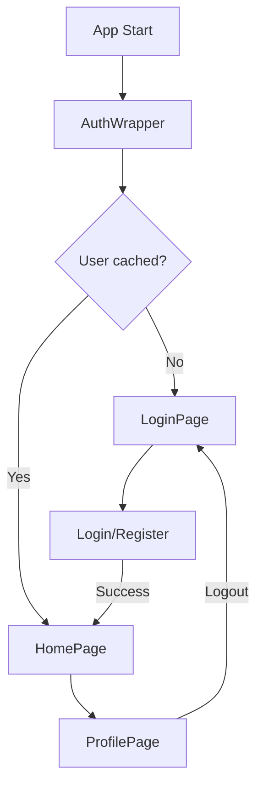

# Fake Store E-commerce

A full-featured Flutter e-commerce app consuming the [Fake Store API](https://fakestoreapi.com/). Built using Clean Architecture and the BLoC pattern for predictable state management.

[](https://flutter.dev)
[](https://dart.dev)
[](test/)
[](https://dart.dev/tools/linter-rules)

## Features

### E-commerce
- **Product catalog** - Category navigation and full listing
- **Search** - Product search with 300ms debounce
- **Product details** - Detailed view with rating and description
- **Shopping cart** - Add/remove/update quantities with local persistence
- **Checkout** - End-to-end purchase flow with confirmation
- **Order history** - View past purchases

### Authentication
- **Login** - Sign in with credential validation
- **Register** - Create a new account with validations
- **Logout** - Safe sign out
- **Session persistence** - Keeps the user signed in
- **Auth wrapper** - Auto-redirect based on auth state

### User Profile
- **User info** - Name, email, username
- **Quick navigation** - Access to Orders and Support
- **Sign out** - With confirmation dialog
- **Unauthenticated state** - Login/register CTAs

### Support & Help
- **FAQs** - 18 categorized frequently asked questions
- **Categories** - Orders, Payments, Shipping, Returns, Account, General
- **Contact form** - Send messages with validation
- **Contact info** - Support email and phone

### Design System Integration
- **Full coverage** - Atoms, Molecules, Organisms
- **Theme tokens** - Colors, spacing, sizes
- **Atomic Design** - Reusable and scalable components

### Technical Highlights
- **JSON configuration** - Configurable texts and images without code changes
- **Local persistence** - Cart, orders, and session stored locally
- **Cross-platform** - Android, iOS, Web
- **Clean Architecture** - Clear layer separation
- **BLoC pattern** - Predictable state management
- **Dependency Injection** - Using `get_it`
- **100% linter clean** - No errors or warnings

## Architecture

The project follows **Clean Architecture** with a clear three-layer split:

```
lib/
├── app.dart                    # MaterialApp with AuthWrapper
├── main.dart                   # Entry point + DI bootstrap
├── core/                       # Shared core layer
│   ├── config/                 # JSON configuration
│   ├── constants/              # Application constants
│   ├── di/                     # Dependency injection (get_it)
│   ├── router/                 # AppRouter, Routes, AuthWrapper
│   ├── theme/                  # App theme
│   └── utils/                  # Extensions and utilities
├── features/                   # App features
│   ├── auth/                   # Authentication
│   │   ├── data/               # AuthLocalDataSource, UserModel, Repository
│   │   ├── domain/             # User, AuthRepository, UseCases
│   │   └── presentation/       # AuthBloc, LoginPage, RegisterPage
│   ├── cart/                   # Shopping cart
│   ├── categories/             # Categories
│   ├── checkout/               # Checkout
│   ├── home/                   # Home
│   ├── orders/                 # Order history
│   ├── products/               # Products & details
│   ├── profile/                # User profile
│   │   └── presentation/       # ProfilePage with logout
│   ├── search/                 # Product search
│   └── support/                # Support & help
│       ├── data/               # SupportLocalDataSource, Models
│       ├── domain/             # FAQItem, ContactMessage, UseCases
│       └── presentation/       # SupportBloc, SupportPage, ContactPage
└── shared/                     # Shared widgets
    └── widgets/                # AppScaffold, DSProductRating, etc.
```

### BLoC Pattern

Each feature follows the BLoC (Business Logic Component) pattern:

- **Events** - User intents (sealed classes)
- **States** - UI states (sealed classes with Equatable)
- **BLoC** - Business logic transforming events into states

### Dependency Injection

`get_it` is used for dependency injection across all layers:

```dart
// Data Sources
sl.registerLazySingleton<AuthLocalDataSource>(
  () => AuthLocalDataSourceImpl(sharedPreferences: sl()),
);

// Repositories
sl.registerLazySingleton<AuthRepository>(
  () => AuthRepositoryImpl(localDataSource: sl()),
);

// Use Cases
sl.registerLazySingleton(() => LoginUseCase(repository: sl()));

// BLoCs
sl.registerFactory(() => AuthBloc(
  loginUseCase: sl(),
  registerUseCase: sl(),
  logoutUseCase: sl(),
  getCurrentUserUseCase: sl(),
));
```

## External Dependencies

This project consumes two packages built in previous phases:

| Package | Description | Repository |
|---------|-------------|-------------|
| `fake_store_api_client` | HTTP client for Fake Store API | [ruta_flutter_f3](https://github.com/juansuarez-pragma/ruta_flutter_f3) |
| `fake_store_design_system` | Design System UI components | [ruta_flutter_f4](https://github.com/juansuarez-pragma/ruta_flutter_f4) |

### Main Dependencies

```yaml
dependencies:
  flutter_bloc: ^8.1.6         # State management
  get_it: ^8.3.0               # Dependency injection
  shared_preferences: ^2.5.3   # Local persistence
  cached_network_image: ^3.4.2 # Image caching
  dartz: ^0.10.1               # Either pattern
  equatable: ^2.0.8            # Value equality
  uuid: ^4.5.1                 # ID generation

dev_dependencies:
  flutter_test:
    sdk: flutter
  bloc_test: ^9.1.7            # BLoC testing
  mocktail: ^1.0.4             # Mocking
  flutter_lints: ^5.0.0        # Linting
```

## Design System Integration

The app uses **all** Design System components following the **Atomic Design** pattern:

### Used Components

| Category | Components |
|-----------|-------------|
| **Tokens** | DSSpacing, DSSizes, DSBorderRadius, DSColors |
| **Atoms** | DSText, DSButton, DSIconButton, DSBadge, DSCircularLoader |
| **Molecules** | DSCard, DSProductCard, DSFilterChip, DSEmptyState, DSErrorState, DSLoadingState |
| **Organisms** | DSAppBar, DSBottomNav, DSProductGrid |

### Theme Tokens

Tokens are accessed via the `context.tokens` extension:

```dart
final tokens = context.tokens;
tokens.colorBrandPrimary        // Primary color
tokens.colorTextSecondary       // Secondary text
tokens.colorBorderPrimary       // Borders
tokens.colorFeedbackSuccess     // Success feedback
tokens.colorFeedbackError       // Errors
```

### Custom Shared Widgets

The project includes custom widgets that extend the Design System:

- `AppScaffold` - Scaffold with integrated bottom navigation
- `DSProductRating` - Rating widget with star + review count
- `QuantitySelector` - Numeric selector using `DSIconButton`

## Authentication Flow



**Key behaviors:**
- Auto session check on app start
- Smart login/home redirect
- SharedPreferences persistence
- Logout confirmation

## Support System

### FAQs (18 items)
- **Orders**: Tracking, cancellation, delivery times
- **Payments**: Payment methods, security, invoices
- **Shipping**: International shipping, costs
- **Returns**: Return policy, process
- **Account**: Account creation, password recovery
- **General**: Physical stores, authenticity

### Contact Form
- Full client-side validations
- Local message persistence
- Extra contact information

## Testing

### Test Coverage

```bash
$ flutter test
206 tests passed ✅

# Breakdown by feature:
- Auth: 73/73 tests
- Support: 10/10 tests
- Cart: 25/25 tests
- Design System: 52/52 tests
- Orders, Products, etc: 46 tests
```

### Running Tests

```bash
# All tests
flutter test

# With coverage
flutter test --coverage
genhtml coverage/lcov.info -o coverage/html
open coverage/html/index.html

# Targeted tests
flutter test test/features/auth/
flutter test test/features/support/
```

### Test Types

- **Unit tests** - Entities, use cases, models, repositories
- **BLoC tests** - States and events using `bloc_test`
- **Widget tests** - Design System components

## JSON Configuration (Phase 7)

The app allows configuring texts and images through a JSON file:

### Location

```
assets/config/app_config.json
```

### Structure

```json
{
  "orderHistory": {
    "pageTitle": "My Orders",
    "emptyState": {
      "title": "You have no orders",
      "description": "When you place an order, it will show up here"
    },
    "orderCard": {
      "orderLabel": "Order",
      "statusLabels": {
        "completed": "Completed",
        "pending": "Pending",
        "cancelled": "Cancelled"
      }
    }
  },
  "images": {
    "emptyOrdersPlaceholder": "https://..."
  },
  "settings": {
    "maxOrdersToShow": 50,
    "currency": { "symbol": "$", "code": "USD" }
  }
}
```

### Editing Text

1. Edit `assets/config/app_config.json`
2. Change the desired values
3. Hot Restart (capital `R` in the terminal)

Configuration is defined in `assets/config/app_config.json`.

## Installation & Run

### Requirements

- Flutter SDK >= 3.29.2
- Dart SDK >= 3.9.2

### Setup

```bash
# Clone the repository
git clone https://github.com/juansuarez-pragma/ruta_flutter_f5_ecommerce.git
cd ruta_flutter_f5_ecommerce

# Install dependencies
flutter pub get

# Run in dev mode
flutter run
```

### Useful Commands

```bash
# Run on different platforms
flutter run -d chrome          # Web
flutter run -d ios             # iOS Simulator
flutter run -d <android_device> # Android

# Build for production
flutter build web              # Web
flutter build apk              # Android APK
flutter build appbundle        # Android App Bundle
flutter build ios              # iOS

# Tests
flutter test                   # Run tests
flutter test --coverage        # With coverage

# Code quality
flutter analyze                # Static analysis (0 issues)
dart format lib/               # Format code
dart fix --apply               # Apply automatic fixes
```

## Feature Details

### Home
- Shows available categories with navigable tiles
- Lists featured products using `DSProductCard`
- Pull-to-refresh to update content
- Navigation to the full catalog

### Products
- Responsive product grid with image, price, and rating
- Category filtering
- Product details view with full description
- "Add to cart" button with feedback
- Star-based visual rating

### Cart
- Product list with image, price, and quantity
- Update quantities with `QuantitySelector`
- Remove items with confirmation
- Summary with subtotal, taxes, and total
- SharedPreferences persistence
- Navigation bar badge with item count

### Search
- Search field with icon
- 300ms debounce to optimize requests
- Real-time results
- Product grid with consistent styling

### Checkout
- Order summary with product list
- Shipping form (name, address, email)
- Purchase confirmation
- Success page with a unique order number
- Auto redirect to order history

### Orders (History)
- Order list with date and status
- Product breakdown per order
- Visual statuses (completed, pending, cancelled)
- Local persistence
- Texts driven by JSON config
- Empty state when there are no orders

### Auth (Authentication)
- **LoginPage**: Email + password with validation
- **RegisterPage**: Full form with password confirmation
- **Validations**: Email format, strong password (8+ chars)
- **AuthWrapper**: Session check on startup
- **Persistence**: User stored in SharedPreferences
- **Tests**: 73 tests covering all cases

### Profile
- User info (avatar, name, email, username)
- Navigation options to Orders and Support
- Logout button with confirmation dialog
- Unauthenticated view with login/register buttons
- Auto redirect after logout

### Support
- **SupportPage**: Expandable FAQ list (accordion)
- **Filters**: 6 FAQ categories
- **ContactPage**: Full form (name, email, subject, message)
- **Validations**: Field-level rules for all inputs
- **Persistence**: Messages stored locally
- **Mock data**: 18 predefined FAQs

## Code Quality

### Linter

```bash
$ flutter analyze
Analyzing ecommerce...
No issues found! (ran in 1.4s)
```

✅ **0 errors**
✅ **0 warnings**
✅ **0 info hints**

### Standards

- ✅ Clean Architecture across all features
- ✅ BLoC pattern for state management
- ✅ Dependency injection with `get_it`
- ✅ Either pattern for error handling
- ✅ Sealed classes for events and states
- ✅ Equatable for value equality
- ✅ `const` constructors where possible
- ✅ Organized imports with no duplicates
- ✅ Public API doc comments

## Commit Structure

This project follows **Conventional Commits**:

```
feat: new feature
fix: bug fix
refactor: refactor
style: formatting-only changes
docs: documentation changes
test: add/update tests
chore: tooling/config changes
```

### Recent Commits

```bash
8d2274d style: resolve all remaining linter info hints (100% clean)
9127e8c fix: resolve all critical linter errors and warnings
a296ba2 feat: add ProfilePage with logout functionality
2b73fa5 feat: complete Support feature with UI pages and full integration
6a862bb feat: implement Auth and Support features with complete flow integration
```

## Contributing

1. Fork the repository
2. Create a feature branch (`git checkout -b feature/new-feature`)
3. Follow Clean Architecture and the BLoC pattern
4. Write tests for new behavior
5. Ensure `flutter analyze` reports 0 issues
6. Commit changes following Conventional Commits
7. Push the branch (`git push origin feature/new-feature`)
8. Open a Pull Request with a clear description

## Additional Documentation

- [CLAUDE.md](CLAUDE.md) - Contributor guide (architecture, commands, conventions)

## Roadmap

### Done
- [x] Product catalog and categories
- [x] Shopping cart with persistence
- [x] Checkout and order confirmation
- [x] Order history
- [x] Product search
- [x] JSON configuration
- [x] Authentication (Login/Register/Logout)
- [x] User profile
- [x] Support system (FAQs and Contact)
- [x] Test suite passing (`flutter test`)
- [x] 100% linter clean

### Next
- [ ] Widget tests for all pages
- [ ] Integration tests (end-to-end flows)
- [ ] Full responsive design polish
- [ ] Wishlist
- [ ] Push notifications
- [ ] Full dark mode
- [ ] Internationalization (i18n)

## License

This project is part of Pragma's Flutter learning path.

## Author

Juan Carlos Suárez Marín
GitHub: [@juansuarez-pragma](https://github.com/juansuarez-pragma)

---

Built with Flutter & Claude Code.

[](https://flutter.dev)
[](https://claude.ai)
